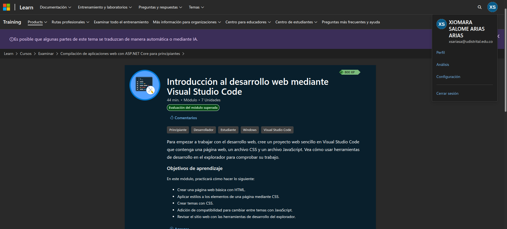
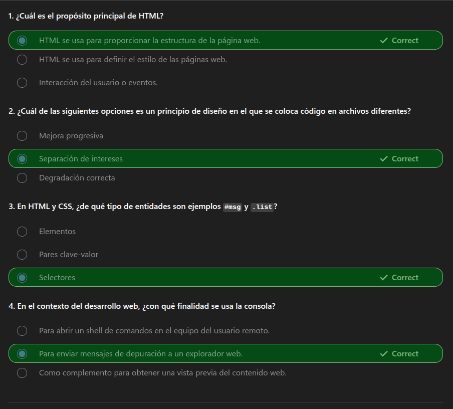

# Práctica: Introducción al desarrollo web con Visual Studio Code

## Descripción

Práctica realizada a partir del módulo **[Introducción al desarrollo web
mediante Visual Studio
Code](https://learn.microsoft.com/es-es/training/modules/get-started-with-web-development/)**
de Microsoft Learn.

El ejercicio permitió desarrollar una página web sencilla utilizando
**HTML, CSS y JavaScript**, integrando estructura, estilos e
interactividad en un mismo proyecto.

## ¿Qué se aprendió?

Durante la práctica se reforzaron los siguientes conceptos:

-   Crear la estructura básica de una página web utilizando **HTML**.
-   Aplicar estilos y definir variables de diseño mediante **CSS**.
-   Crear diferentes temas visuales, como **modo claro y modo oscuro**.
-   Utilizar **JavaScript** para agregar interactividad a la página.
-   Modificar clases CSS dinámicamente mediante JavaScript.
-   Cambiar elementos de la interfaz, como el contenido o la imagen de
    un botón, según la interacción del usuario.
-   Utilizar las herramientas de desarrollo del navegador para revisar y
    comprobar el funcionamiento de la página.
-   Comprender la relación entre **HTML, CSS y JavaScript** dentro de
    una aplicación web.
-   Adicionalmente, se agregó un componente nuevo de forma independiente, integrando otras funciones para crear un portafolio sencillo de productos.

## Evidencia de la práctica




```